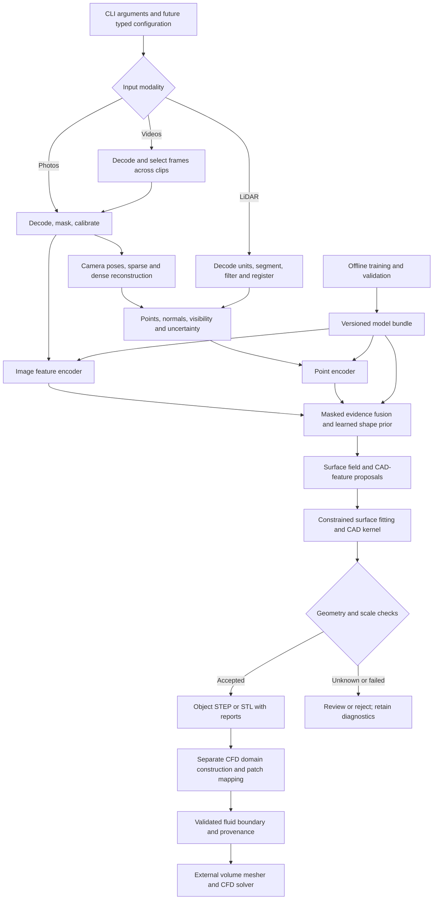

# Scan2Flow technical documentation

This document specifies the architecture, environment, data flow, and complete CLI contract for Scan2Flow `0.1.0.dev0`. It is accompanied by the [ML pipeline guide](docs/ML_PIPELINE.md), [CFD guide](docs/CFD_GUIDE.md), and [complete project skeleton](docs/PROJECT_STRUCTURE.md).

## Scope and implementation status

Scan2Flow is a CLI for the intended workflow **capture → reconstruct → fit CAD → validate → prepare fluid geometry**. A separate training workflow learns geometric and CAD-feature priors from paired visual/spatial data and CAD targets.

Implemented: package installation, console/module entry points, help, version, argument validation, JSON dry-run plans, and dependency discovery. Unimplemented: capture decoding, model loading, training, reconstruction, CAD export, quality measurements, and CFD domain preparation. Domain packages are documented placeholders. Configurations and schemas describe proposed backend contracts; the CLI does not load or enforce them.

The design targets rigid objects with sufficient visual or spatial coverage. Hidden surfaces, reflective/transparent materials, thin walls, repetitive texture, small passages, and unfamiliar part families need explicit uncertainty and failure handling. No capture method or requested tolerance guarantees engineering accuracy.

## System architecture

### Data flow



All processing nodes after CLI parsing are planned. Multi-view methods provide geometric evidence when camera motion and overlap are sufficient. A single photo cannot use multi-view triangulation; it follows an explicitly marked learned-prior path. Missing image or point modalities are masked during training and inference, rather than fabricated.

COLMAP's documented workflow recovers camera poses and sparse structure before dense reconstruction; it is a candidate geometric frontend, not a CAD generator. [COLMAP tutorial](https://colmap.github.io/tutorial).

### Stage boundaries and artifacts

| Stage / source package | Responsibility | Planned output and failure conditions |
|---|---|---|
| `cli` | Parse commands and select a pipeline | Current plan or explicit unimplemented error |
| `ingestion` | Decode supplied image/video/cloud files and capture metadata | Immutable input inventory with hashes; reject undecodable or unsupported assets |
| `preprocessing` | Masks, calibration, frame selection, denoising, metric transforms | Observations, masks, normals and transforms; report missing coverage and unresolved scale |
| `reconstruction` | Camera estimation, point registration, surface inference orchestration | Geometric evidence with uncertainty; reject disconnected registrations |
| `models` | Image/point encoders, fusion, surface and feature prediction | Typed geometric proposals, observed/inferred labels, calibrated confidence |
| `cad` | Primitive/NURBS fitting, trimming, sewing, topology checks and export | Valid B-rep or explicit fitting failure; mesh-only evidence must stay identified |
| `cfd` | Construct external/internal fluid regions, cap declared openings and map patches | Fluid-boundary geometry and validation report; reject ambiguous regions |
| `data`, `training` | Validate manifests, split data, generate batches and optimize models | Reproducible checkpoint bundles and training history |
| `evaluation` | Compute geometry, topology, coverage and downstream metrics | Per-object results, aggregate/slice metrics, baseline comparison |
| `pipeline`, `utils` | Stage coordination, artifact manifests, logging, hashing and units | Atomic job lifecycle and actionable diagnostics |

The packages above currently contain role descriptions, not working pipeline implementations. Heavy libraries should be imported inside their adapters, keeping help, planning, and diagnostics usable without CAD or GPU installations.

### Reconstruction and CAD representation

1. Preserve capture files and assemble a manifest identifying the object, sensor, calibration, and physical units.
2. Segment the object. Select sharp, diverse frames; update intrinsics after crop, resize, or undistortion. For multiple videos, preserve per-clip camera metadata and find overlap across clips.
3. Estimate poses and structure for multiple images, or register LiDAR observations in a common metric frame. Record residuals and rejected observations. A low registration residual alone cannot establish correct alignment on symmetric geometry.
4. Encode images and/or points. Fuse the available evidence with modality masks, then predict surface geometry and CAD features. Keep observed regions distinguishable from learned completion.
5. Fit planes, cylinders, cones, freeform surfaces, intersections, and boundaries under geometric constraints. Use an allowlisted intermediate representation; never execute arbitrary model-generated Python.
6. Build faces, edges, shells, and solids with a CAD kernel. Reject invalid trims or topology. Sewing nearby boundaries and healing small gaps must have measured displacement bounds and must preserve functional openings.
7. Validate dimensions, coverage, B-rep validity, manifoldness, watertightness where required, self-intersection, component counts, and orientation. Export only the representations whose checks succeed.

A surface mesh stores triangles; a B-rep stores bounded surfaces and topology. Converting every triangle into a STEP face does not recover meaningful analytic CAD. STEP exchange also does not necessarily preserve a native editable feature history. The proposed fitting path is therefore a substantive engineering stage, not a file-extension conversion.

### Architectural choices and alternatives

The architecture was developed with the installed [affaan-m/ECC](https://github.com/affaan-m/ECC) plugin. [ECC_WORKFLOW.md](docs/ECC_WORKFLOW.md) records the skills and setup instructions used.

| Choice | Rationale | Alternative and consequence |
|---|---|---|
| Local modular Python CLI | Batch workflows suit capture processing and training; a small parser remains easy to install | A service would add deployment and API concerns outside the CLI requirement |
| Classical geometry plus learned priors | Use measurable pose/registration evidence while learning missing shape and feature cues | Pure end-to-end CAD token generation is a research track with weaker geometric guarantees |
| Surface and analytic-feature proposals before kernel construction | Separate perception errors from CAD validity and topology failures | Mesh-only export is simpler but cannot claim analytic CAD recovery |
| Shared preprocessing and immutable model bundles | Training and inference must agree on units, normalization and sensor conventions | Independent notebook transforms risk silent incompatibility |
| Object geometry separate from fluid geometry | Internal and external flows require different regions and boundary semantics | A single automatic solid export cannot define a valid case for every solver |
| Unknown results block automatic acceptance | Missing measurements cannot establish quality | Returning success on plausible appearance would conceal unobserved or invalid geometry |

CLI packaging is implemented. Backend choices are a proposed baseline, subject to the first measured experiment rather than claims of an already validated stack.

## Backend development environment

Start with the [scaffold installation](README.md#installation). Only its core/dev packages are declared in `pyproject.toml`; there are no `ml`, `cad`, or `all` extras yet.

| Component | Intended use | Setup and compatibility guidance |
|---|---|---|
| PyTorch | Training and inference | Select a CPU/CUDA build using the official [installation selector](https://pytorch.org/get-started/locally/); match the host driver and selected wheel |
| COLMAP | Multi-view pose and geometric baseline | Install the CLI from [COLMAP instructions](https://colmap.github.io/install.html); GPU support depends on build and selected stages |
| FFmpeg | Decode and sample video | Use an appropriate system build from [FFmpeg downloads](https://ffmpeg.org/download.html); make `ffmpeg` available on `PATH` |
| Open3D | Point-cloud filtering, registration and surface baselines | Follow [Open3D setup](https://www.open3d.org/docs/release/getting_started.html); check supported Python/platform combinations |
| CadQuery / Open CASCADE | CAD construction, healing and STEP/STL export | Use a supported environment from [CadQuery installation](https://cadquery.readthedocs.io/en/latest/installation.html); binary dependencies can limit Python/platform combinations |
| Gmsh or a solver mesher | External surface/volume meshing | Consult the [Gmsh manual](https://gmsh.info/doc/texinfo/) or your solver's meshing documentation |
| OpenFOAM or another CFD solver | External simulation workflow | Keep solver environment, case settings and version recorded separately |

For an isolated experiment, after choosing a mutually supported Python/platform combination, the upstream pip packages can be installed explicitly:

```bash
python -m pip install open3d cadquery
```

Install PyTorch using the command produced by its official selector, then install the required system binaries. The command above is exploratory environment setup, not a tested Scan2Flow backend installation. CadQuery also documents a conda-based route when binary dependencies require it. Do not combine multiple package managers in an environment without checking resolution and recording the final result.

```bash
scan2flow doctor --json
```

`doctor` checks distribution metadata and executable discovery. It does not import native libraries, run CUDA, check codecs, execute COLMAP, or prove that the components work together. Before enabling a backend, record OS/architecture, Python and dependency versions, CUDA/driver information, the code revision, a successful import/smoke test, and a resolved environment lock. No such backend lock or performance benchmark is included in this foundation.

## Capture and input contract

### Input organization

One `reconstruct` invocation describes one rigid object. Repeat `--input` for files in a deterministic order. Photo and video inputs cannot be mixed in one invocation. Multiple LiDAR observations use the same input-unit declaration; independently posed scans need registration metadata and sufficient overlap in the planned backend.

The initial adapter targets are JPEG/PNG photos, video containers decodable by the chosen FFmpeg build such as MP4/MOV, and PLY/PCD point clouds. These are planned targets, not currently supported decoders. LAS/LAZ, E57, proprietary LiDAR formats, live sensors, directory discovery, and mixed sensor jobs require explicitly implemented adapters. No file extension is validated during dry-run planning.

| Capture | Required evidence | Common failure modes |
|---|---|---|
| Single photo | Object mask, approximate known dimension, compatible learned prior; calibration when available | Unseen back faces, ambiguous depth, uncertain scale, unsupported part family |
| Multiple photos | Overlapping views, parallax, stable rigid object, scale measurement | Textureless or repeating surfaces, motion blur, disconnected camera groups |
| Video / several clips | Same requirements as photos plus frame timestamps and per-clip metadata | Near-duplicate frames, changing focus/intrinsics, rolling shutter, clipped highlights |
| LiDAR | Coordinate units, object segmentation, sensor transforms when needed | Missing returns, grazing-angle noise, multipath, holes and registration ambiguity |

Use diffuse lighting and varied viewing angles. Keep camera focus/zoom fixed where feasible. A turntable needs object/background separation: static background and rotating object cannot both satisfy one rigid camera-motion model. Additional views should expose geometry critical to flow, particularly inlets, outlets, thin gaps, and internal passages. Exterior photographs do not establish internal duct shape.

### Units, scale and coordinate frames

The proposed processing frame is right-handed, Z-up, with geometry expressed in **metres**. Preserve the transform from capture coordinates to canonical/model coordinates, including normalization scale and translation, and its inverse.

- `reconstruct --units` selects output geometry units and the unit of `--known-length`.
- `--known-length` is required for photo/video and means the measured longest side of the object's oriented bounding box. If the reconstructed longest side is `b`, the nominal scale factor is `known_length_in_metres / b`. A wrong or poorly observed extent biases all dimensions; validate several independent dimensions.
- `--scan-units` is required for LiDAR and means the source point-coordinate unit. LiDAR does not accept `--known-length`.
- `--voxel-size` and `--tolerance` are always metres, regardless of `--units` or `--scan-units`.
- `prepare-cfd --units` declares the input geometry's coordinate unit. The planned domain configs and resulting fluid-domain geometry use metres. Reject a disagreement between STEP unit metadata, its provenance, and the supplied unit; never silently rescale twice.

For example, `--known-length 250 --units mm` anchors a 0.25 m object. `--tolerance 0.0001` always requests 0.1 mm. This is a fitting/check parameter, not a measured scan accuracy or guaranteed CAD error bound.

Camera calibration is described by [calibration.schema.json](schemas/calibration.schema.json) and the [example calibration](examples/README.md). The proposed camera convention is +X right, +Y down, +Z forward; `world_from_sensor` is a row-major homogeneous matrix acting on column vectors. Translations use metres. Camera pixel intrinsics must match the actual image after preprocessing. Inverse transforms, sensor IDs, timestamps and alignment need semantic validation beyond JSON shape checks.

### Dataset and artifact contracts

Training examples use versioned JSONL manifests validated against [dataset-record.schema.json](schemas/dataset-record.schema.json). Each record identifies the object, related CAD family, capture session, split, modality, input assets, CAD target, physical unit, checksums, and provenance. The same object/family/session and its synthetic derivatives must stay in one split. A JSON Schema cannot detect leakage or prove that a checksum matches an asset; future validators must inspect the complete dataset.

The [configuration guide](configs/README.md) and [schema guide](schemas/README.md) define the proposed fields and examples. Config paths on the CLI are relative to the current working directory; the backend convention for paths within each config/manifest must follow those guides. No user-level configuration, environment-variable override, or implicit checkpoint download is implemented.

## Machine learning pipeline

The detailed design is in [ML_PIPELINE.md](docs/ML_PIPELINE.md). The following stages define the implementation sequence and acceptance expectations.

### Data and labels

Build a dataset of valid CAD solids paired with rendered images, simulated depth/point clouds, and, where available, calibrated real scans of the same parts. Ground-truth labels include surface samples, normals, analytic face classes and parameters, trims/adjacency, feature annotations, camera poses, masks, physical dimensions, and observation visibility. Do not equate a display mesh with an exact CAD target.

Split by object and related CAD family before rendering or augmentation; keep repeated captures and near-duplicate parametric variants together. Freeze test data. Validate provenance and license terms for both source CAD and captures. Record uncertainty and missing labels explicitly, then mask unavailable losses.

### Baseline and model

First establish a classical multi-view/point-cloud reconstruction and primitive-fitting baseline. It exposes dataset, calibration, and scale failures before adding learned complexity.

The proposed learned model has image and point encoders, masked fusion, a surface/SDF decoder, and CAD-feature heads. Supervision combines surface distance, normals, silhouettes, feature classification, parameter regression, adjacency, and SDF regularization where applicable. Normalize the terms deliberately; a metre-valued distance and a dimensionless classification loss are not interchangeable. CAD-kernel fitting is normally a separate, non-differentiable stage; gradients cannot simply pass through arbitrary healing/Boolean operations.

Start with supported primitive families and measure failures. Extend to trimmed/freeform surfaces or sequence-based construction only when evaluation justifies the added complexity. A model can produce different CAD representations of similar geometry, so evaluate resulting geometry and topology in addition to feature-label agreement.

### Training and evaluation lifecycle

1. Validate a frozen dataset manifest, hashes, units, transforms and split boundaries.
2. Generate deterministic preprocessing caches keyed by dataset/config/preprocessor version.
3. Train with the [training template](configs/train.toml), recording seed, code revision, resolved config, environment, optimizer, scheduler and RNG state.
4. Select checkpoints using the validation split. Use early stopping and error slices; reserve the test split for declared evaluation.
5. Evaluate physical-unit geometry, dimensions, normals, topology, solid validity, coverage, abstention rate, runtime and memory against the baseline.
6. Calibrate confidence and establish application-specific acceptance thresholds. Missing evidence or unreviewed thresholds must prevent promotion.
7. Package weights, architecture metadata, preprocessing, training provenance, metrics and a model card in an immutable bundle. Record the previous approved bundle for rollback.

Current entry-point plans:

```bash
scan2flow train --config configs/train.toml --output artifacts/training/baseline --device cuda --seed 42 --dry-run
scan2flow evaluate --config configs/evaluate.toml --checkpoint models/checkpoints/baseline --split validation --output artifacts/evaluation/validation --dry-run
```

Evaluate a held-out test set only after selecting model/settings. Do not align predicted geometry with a free scale transform when reporting dimensional accuracy; that would hide scale errors. Report failed reconstructions and unsupported examples, not just successful samples. F-score distance settings in example configs are illustrative measurement settings, not validated acceptance gates.

### Deployment and operation

Deployment means loading an approved bundle in a local CLI job. Verify its schema, hashes, architecture, preprocessing and compatible environment before reading weights. Prefer non-executable tensor formats for inference weights; only load trusted resume state, and never run code from a checkpoint bundle.

Record bundle ID, input/config hashes, elapsed time, memory, observation coverage and failure category with each run. Keep customer geometry out of logs by default. Compare sensor/material/family slices after model updates. On regression, select the previous compatible bundle using `--checkpoint`; rolling back should not require retraining. The current CLI neither loads nor promotes bundles.

## CFD integration

See [CFD_GUIDE.md](docs/CFD_GUIDE.md) for the detailed procedure and upstream references.

### Geometry acceptance

Verify physical dimensions independently, then inspect topology, self-intersection, orientation, duplicate/internal faces, shell closure, and minimum flow-relevant features. Bound healing displacement relative to metrology and feature sizes. Simplification must preserve critical openings, leading/trailing edges, gaps, roughness assumptions, and hydraulic diameters.

An accepted reconstruction is an input to fluid preparation; it does not certify a mesh or simulation. Geometry with unknown required checks remains `needs_review` or `rejected`, according to the proposed [reconstruction quality-report schema](schemas/reconstruction-report.schema.json).

### External and internal domains

- **External flow:** construct an enclosure aligned with the chosen flow direction and subtract the solid object. Assign inlet, outlet, farfield and object-wall regions. Test sensitivity to domain extent; the provided enclosure ratios are illustrative starting values.
- **Internal flow:** identify the actual connected fluid volume using observed interior walls and a region seed. Cap only explicitly declared inlet/outlet openings. Validate that a cap did not close a branch or create a false passage. Exterior-only data is insufficient evidence of internal geometry.

Patch identities need geometry-based selectors and a saved mapping after CAD topology changes; face index numbers alone are unstable. The union of patches must cover the intended fluid boundary without overlaps or unassigned faces.

```bash
scan2flow prepare-cfd --input artifacts/reconstruction/example/object.step --output artifacts/cfd/external --flow external --units m --domain configs/cfd-external.toml --dry-run
scan2flow prepare-cfd --input artifacts/reconstruction/duct/object.step --output artifacts/cfd/internal --flow internal --units m --domain configs/cfd-internal.toml --dry-run
```

Both are plans. No domain, mesh or solver case is generated in this release.

### Meshing and simulation

Import STEP into a compatible CAD/volume mesher, or use a validated STL boundary with the correct physical scale. Preserve named boundary regions through export. Create a volume mesh with refinement near curvature, narrow passages, separation regions, and expected gradients. Choose near-wall spacing/layers from the Reynolds number, turbulence treatment and intended wall resolution.

Check mesh validity and quality with the selected solver's tools. Set fluid properties, physical boundary conditions, turbulence/transition assumptions and numerical schemes explicitly. Verify mass balance, convergence of relevant forces/pressure drop, mesh independence, domain independence and, for unsteady calculations, time-step sensitivity. Separate geometric uncertainty from numerical error and model-form uncertainty. There is no universal domain multiplier, mesh-quality cutoff or wall `y+` target suitable for every case.

## CLI reference

This section describes **all currently accepted commands and flags**. The tables distinguish parser behavior from intended future execution semantics.

### Invocation and global options

```text
scan2flow [-h | --help] [--version] COMMAND ...
python -m scan2flow [-h | --help] [--version] COMMAND ...
```

| Option / argument | Meaning |
|---|---|
| `-h`, `--help` | Print top-level help and exit `0` |
| `--version` | Print `scan2flow 0.1.0.dev0` and exit `0`; use before a subcommand |
| `COMMAND` | Required unless requesting help/version: `reconstruct`, `train`, `evaluate`, `prepare-cfd`, or `doctor` |

Use command-specific options after the command. Each command also has `-h`/`--help`. Names are case-sensitive and option abbreviations are disabled. No arguments produces a usage error (`2`). There are no positional file arguments or implicit default commands.

### Shared workflow behavior

| Option | Applies to | Meaning |
|---|---|---|
| `--dry-run` | All commands except `doctor` | Boolean, default false. Validate CLI syntax/relationships and print a JSON plan; no inputs/configs/checkpoints are read and no outputs are created |
| `--output PATH` | All commands except `doctor` | Required destination directory in the future backend. Path is only recorded today |
| `--device {auto,cpu,cuda}` | `reconstruct`, `train`, `evaluate` | Default `auto`. Planned selection: CUDA when supported/available, otherwise CPU; explicit `cuda` must fail if unavailable. No GPU discovery or allocation occurs today |
| `--seed INTEGER` | `reconstruct`, `train` | Default `42`; integer >= 0. Records the requested seed; does not promise cross-platform determinism |

Relative paths are preserved as supplied and refer to the current working directory. The current parser accepts strings without checking existence, suffix, permissions or contents. Quote spaces. Repeat only `reconstruct --input` to supply multiple files; its order is preserved. For other scalar options repeated values follow argparse's last-value behavior. Globs, directory expansion, stdin assets, URI fetching, environment-based overrides, `--force`, `--verbose` and `--config` on `reconstruct` are not implemented.

Finite positive numeric values are required where listed; `0`, negatives, `NaN` and infinities are rejected for positive-valued settings. Type, choice, required-flag and cross-option errors return `2` before any workflow execution.

### `reconstruct`

```text
scan2flow reconstruct --input PATH [--input PATH ...]
  --input-type {photo,video,lidar} --output PATH --checkpoint PATH
  [--calibration PATH] [--units {m,cm,mm}] [--known-length NUMBER]
  [--scan-units {m,cm,mm}] [--frame-step N] [--max-frames N]
  [--voxel-size METRES] [--tolerance METRES] [--format {step,stl,both}]
  [--device {auto,cpu,cuda}] [--seed INTEGER] [--dry-run] [-h]
```

| Option | Required / default | Definition |
|---|---|---|
| `--input PATH` | Required; repeatable | Explicit files depicting one object; planned modality-specific decoding |
| `--input-type` | Required | `photo`, `video`, or `lidar`; selects one modality for every input |
| `--output PATH` | Required | Planned reconstruction directory |
| `--checkpoint PATH` | Required | Planned compatible model-bundle directory; no bundled default or automatic download |
| `--calibration PATH` | Optional; omitted/null | Proposed camera/sensor calibration JSON; poses may need estimation when absent |
| `--units` | `m` | `m`, `cm`, `mm`; output coordinates and `--known-length` unit |
| `--known-length NUMBER` | Required for `photo`/`video`; forbidden for `lidar` | Finite positive measured longest oriented-bounding-box side; approximate scale anchor |
| `--scan-units` | Required for `lidar`; forbidden otherwise | `m`, `cm`, `mm`; source point-coordinate units |
| `--frame-step N` | Video default `30`; forbidden otherwise | Positive integer; sample every Nth decoded frame in each clip |
| `--max-frames N` | Video default `300`; forbidden otherwise | Positive integer; planned maximum retained frames across all input clips |
| `--voxel-size METRES` | `0.002` | Finite positive downsampling voxel edge in metres; applies to input or reconstructed point evidence |
| `--tolerance METRES` | `0.0001` | Finite positive requested geometry tolerance in metres; an algorithm parameter, not guaranteed accuracy |
| `--format` | `both` | `step`, `stl`, `both`; planned geometry export selection |
| `--device` | `auto` | Shared compute-device choice |
| `--seed` | `42` | Shared nonnegative seed |
| `--dry-run` | False | Print a plan instead of returning the unimplemented-backend error |
| `-h`, `--help` | — | Print command help |

For non-video modes, `frame_step` and `max_frames` are `null` in the JSON plan. Providing either flag explicitly in these modes is an error even if its value matches the video default. Changing calibration does not remove the photo/video scale requirement.

### `train`

```text
scan2flow train --config PATH --output PATH [--resume PATH]
  [--device {auto,cpu,cuda}] [--seed INTEGER] [--dry-run] [-h]
```

| Option | Required / default | Definition |
|---|---|---|
| `--config PATH` | Required | Proposed training TOML; see [train.toml](configs/train.toml) |
| `--output PATH` | Required | Planned run directory for checkpoints, resolved config, metrics and logs |
| `--resume PATH` | Optional; omitted/null | Proposed trusted training-state bundle; includes optimizer/scheduler/RNG state, not only inference weights |
| `--device` | `auto` | Shared compute-device choice |
| `--seed` | `42` | Shared seed; exact future resume restores saved RNG state rather than reseeding silently |
| `--dry-run` | False | Record the requested configuration path without reading it |
| `-h`, `--help` | — | Print command help |

Epochs, batch size, learning rate, model structure and dataset manifests belong in TOML; there are no `--epochs`, `--batch-size` or `--learning-rate` flags. A future resume must validate dataset, model and preprocessing compatibility and distinguish exact continuation from intentional fine-tuning. Fine-tuning flags are not currently defined.

### `evaluate`

```text
scan2flow evaluate --config PATH --checkpoint PATH --output PATH
  [--split {validation,test}] [--device {auto,cpu,cuda}] [--dry-run] [-h]
```

| Option | Required / default | Definition |
|---|---|---|
| `--config PATH` | Required | Proposed evaluation TOML; see [evaluate.toml](configs/evaluate.toml) |
| `--checkpoint PATH` | Required | Proposed model bundle to evaluate |
| `--split` | `test` | `validation` or `test`; use validation during model selection |
| `--output PATH` | Required | Planned per-object, aggregate, slice and provenance reports |
| `--device` | `auto` | Shared compute-device choice |
| `--dry-run` | False | Record a plan; no metrics are computed |
| `-h`, `--help` | — | Print command help |

There is no evaluation `--seed`; the example evaluation config carries the sampling seed. The config declares both manifests, and the planned backend selects one using `--split`.

### `prepare-cfd`

```text
scan2flow prepare-cfd --input PATH --output PATH --flow {external,internal}
  --units {m,cm,mm} --domain PATH [--tolerance METRES] [--dry-run] [-h]
```

| Option | Required / default | Definition |
|---|---|---|
| `--input PATH` | Required; one file | Planned source CAD or validated surface mesh; STEP/STL adapters remain unimplemented |
| `--output PATH` | Required | Planned fluid-geometry and boundary-report directory |
| `--flow` | Required | `external` enclosure-minus-object or `internal` connected fluid-region construction |
| `--units` | Required | `m`, `cm`, `mm`; input coordinate unit; unlike reconstruction, no default |
| `--domain PATH` | Required | Proposed TOML enclosure or opening/region definition; see [external](configs/cfd-external.toml) and [internal](configs/cfd-internal.toml) templates |
| `--tolerance METRES` | `0.0001` | Finite positive geometry tolerance in metres |
| `--dry-run` | False | Record a plan; no CAD is read and no regions are generated |
| `-h`, `--help` | — | Print command help |

The future backend must reject a mismatch between CLI `--flow` and the domain config. This cannot be checked by today's dry-run because it does not read the config. No `--solver`, `--mesh-size`, `--yplus`, or solver execution flag is provided. STL input can follow a surface workflow; it must not silently acquire claims of analytic STEP reconstruction.

### `doctor`

```text
scan2flow doctor [--json] [-h]
```

| Option | Default | Definition |
|---|---|---|
| `--json` | False | Print discovery results as JSON instead of human-readable text |
| `-h`, `--help` | — | Print command help |

Reports the Scan2Flow/Python versions, Python executable, discoverable `ffmpeg` and `colmap` paths, and installed distribution versions for `torch`, `open3d`, and `cadquery`. Missing entries are `null` in JSON or `not found` in text. It returns `0` for a successful inventory even when optional components are absent, with `status: scaffold_available` and `backend: unimplemented`.

### JSON plans, output and exit codes

For example:

```bash
scan2flow train --config configs/train.toml --output artifacts/training/baseline --dry-run
```

prints:

```json
{
  "status": "planned",
  "backend": "unimplemented",
  "command": "train",
  "options": {
    "config": "configs/train.toml",
    "output": "artifacts/training/baseline",
    "resume": null,
    "device": "auto",
    "seed": 42
  },
  "validation": "CLI syntax and cross-option constraints only; no files, configuration contents, or environment checked."
}
```

JSON uses snake_case option names and preserves path strings. Plans, diagnostic reports and help go to stdout; errors go to stderr. Do not parse human-readable error text as a stable machine API.

| Exit code | Current meaning |
|---|---|
| `0` | Help/version printed, syntactically valid dry-run plan, or completed doctor inventory |
| `2` | CLI syntax, missing required flag, invalid value, or incompatible options |
| `3` | Requested reconstruction/training/evaluation/CFD backend is unimplemented |
| `130` | Keyboard interruption caught by the entry point |

Unexpected interpreter/OS failures are outside this application-code contract and may have other nonzero codes. A dry-run's `0` is not success for processing an input, and the future runtime error taxonomy must be defined when execution is implemented.

## Configuration and output lifecycle

The TOML templates are reviewed design examples; no schema-based config loader is included. CLI-only routing settings and paths must remain explicit; future overlapping settings need documented precedence rather than silently merging them. Training config numerical hyperparameters are starting experiment settings, not demonstrated optimal values.

The planned pipeline resolves and records configuration, hashes immutable inputs, verifies model/preprocessor compatibility, and allocates a fresh output directory. It should refuse existing nonempty destinations unless a separately designed resume contract applies. Write incomplete stages to temporary locations, validate them, and publish a completion manifest atomically. Preserve diagnostics on failure without marking failed geometry as accepted. Raw capture files must remain unchanged.

Intended reconstruction outputs are `object.step`/`object.stl` according to `--format`, `quality.json`, and `provenance.json`. Intended CFD outputs describe fluid-region geometry and `boundary_patches.json`; no solver settings are inferred from appearance. A model bundle carries versioned weights, metadata, preprocessing and evaluation evidence as described in [schemas](schemas/README.md).

Checksums and schema-valid metadata provide traceability, not trustworthy geometry by themselves. The backend must separately prove semantic consistency and quality. The scaffold creates no model, CAD, report, cache, or output directory.

## Troubleshooting

| Symptom | Explanation and action |
|---|---|
| `scan2flow` is not found | Use the installed environment's `python -m scan2flow`, or activate its environment |
| PowerShell activation is blocked | Use `.\.venv\Scripts\python.exe -m scan2flow`; changing global execution policy is unnecessary |
| Backend is unimplemented / exit `3` | Expected for processing commands in this foundation; use `--dry-run` to inspect the contract |
| A dry-run succeeds for a nonexistent file | Expected: paths and configuration contents are not inspected |
| `--known-length` or `--scan-units` error | Photo/video needs a known length; LiDAR needs scan units and forbids known length |
| `--frame-step` fails for photos | Frame sampling flags are video-only |
| `doctor` shows packages but reconstruction fails | Discovery does not install or enable a Scan2Flow backend |
| Native CAD/ML package installation fails | Check the upstream supported Python/platform/build combination in a separate environment |
| Future result has the wrong scale | Check source units, scale-anchor meaning, metadata and transforms before changing a mesher |
| Future STEP export or topology validation fails | Inspect invalid fits/trim boundaries and missing observations; do not rename STL to STEP |
| Future mesh loses a flow passage | Compare against source evidence and feature size before healing/defeaturing or increasing tolerances |

## Implementation roadmap and verification

| Milestone | Deliverable | Evidence required before claiming support |
|---|---|---|
| Foundation | CLI, documentation, contracts and package skeleton | Install, parser/no-side-effect tests, lint and package build |
| Geometric baseline | One supported image/cloud path with scale and transforms | Licensed fixtures, held-out measurements, registration failures and reproducible environment |
| Learned reconstruction | Trainable paired-data baseline and inference bundle | Leakage checks, shared preprocessing, baseline/slice comparisons, dimensional metrics |
| CAD fitting | Analytic and selected freeform B-rep fitting | Kernel validity, dimensional limits, openings/topology checks, independent STEP reimport |
| CFD preparation | External/internal fluid boundaries and patch mapping | Closed positive-volume regions, preserved passages, patch coverage and mesher import tests |
| Release qualification | Locked environments, documented hardware, model card and regression suite | Reproducible fresh installation plus measured geometry/CFD evaluation on agreed cases |

The present CI verifies the foundation, not later milestones. [CONTRIBUTING.md](CONTRIBUTING.md) defines development checks; [PROJECT_STRUCTURE.md](docs/PROJECT_STRUCTURE.md) shows where each implementation and test belongs.
