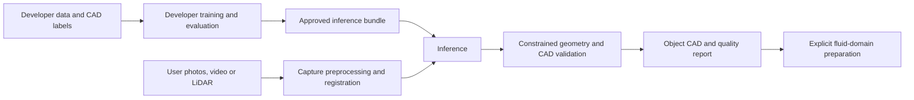

# Scan2Flow — shared development plan

**Audience:** Jack, contributors and coding assistants. Read this before starting work.
This is our source of truth for direction and progress, not the user manual.
The public instructions are in [README.md](README.md) and [the CLI reference](docs/CLI_REFERENCE.md).

## Product objective

Give an end user a local CLI that turns captures of a physical object into
reviewable CAD geometry and then, where appropriate, a fluid-domain boundary for CFD.
The project team develops and trains the model; the user consumes an approved
pretrained model. User installation must not require a dataset, training or model evaluation.

## Decisions to preserve

| Decision | Consequence |
| --- | --- |
| CLI-only product | No GUI, web app or hosted service in the current scope |
| Pretrained inference for users | Public commands are `reconstruct`, `prepare-cfd`, `doctor` |
| Training/evaluation are developer tools | Their code and configs belong in `development/`, outside the installed runtime package |
| Separate perception, CAD and CFD stages | A prediction, valid solid, fluid region and solved CFD case are different deliverables |
| Preserve metric scale and raw inputs | Record transforms and units; do not silently overwrite captures |
| Report uncertainty and unsupported input | Never label inferred hidden surfaces or an unchecked export as validated geometry |
| Demonstrate small working stages first | Avoid building the full multimodal research design before a geometric baseline works |

## Actual implementation state

| Area | State and evidence |
| --- | --- |
| Packaging and CLI entry points | Implemented; install, help and module/console tests exist |
| Public command surface | Only reconstruction, CFD preparation and diagnostics; developer commands and seed removed |
| Model selection | Optional `--model` records a pretrained-bundle override; no model is shipped or loaded |
| Planning and diagnostics | Syntax/cross-option checks, JSON plans and environment inventory work |
| Input readers, registration and inference | Unimplemented; source packages are placeholders |
| CAD fitting/export and fluid-domain preparation | Unimplemented |
| Dataset generation, training and model evaluation | Unimplemented; developer design templates only |
| Numerical accuracy, hardware requirements and model release | Not established |

Processing without `--dry-run` returns the explicit unimplemented-backend error.
A successful plan means the CLI syntax is valid, not that geometry was reconstructed.

## Architecture boundaries

The developer branch produces a release artifact once; it is not executed by a
user reconstruction job. Inference, units and deterministic preprocessing remain
reusable runtime components. Training loops, optimizers, experiment selection and
resume state stay in developer tooling.

The longer-term image/point-fusion design is preserved in
[ARCHITECTURE.md](development/ARCHITECTURE.md) and [ML_PIPELINE.md](development/ML_PIPELINE.md).
Those are research references, not commitments to implement every component now.

## Next experiment

**Proposed first implementation:** metric point cloud → simple primitive parameters
→ valid STEP solid. Start with a small declared vocabulary such as boxes, cylinders
and spheres for external geometry. The specific first real object family still
needs selection; do not claim support for general mechanical assemblies.

1. Define the input/output contract: points in metres, supported geometry and a
   measurable expected CAD result. State how pose and scale are provided.
2. Generate a small reproducible synthetic CAD dataset with known dimensions;
   sample surfaces and add controlled noise/partial observations. Keep related
   object variants and their observations within the same data split.
3. Implement a classical fitting baseline and CAD export/reimport. Measure its
   dimensional errors, invalid-solid rate and failure cases before adding ML.
4. Implement a developer-only point encoder and primitive/parameter prediction
   experiment. Compare against the baseline on held-out objects, then real scans.
5. Export only validated inference weights and metadata for runtime use. Define
   the release model installation/resolution path before enabling automatic selection.

This is an experiment proposal, not an available training command. The broad
[hybrid training template](development/configs/train.toml) is a later research option;
the primitive experiment needs its own smaller configuration when implemented.

## Milestones and completion criteria

| Order | Deliverable | Done when |
| --- | --- | --- |
| 0 | Public/developer separation | Public help, docs, examples and tests agree; developer modules are excluded from the wheel |
| 1 | Metric primitive baseline | Real reader, units, fitting and STEP reimport run on reproducible fixtures; errors and failures are reported |
| 2 | First trained model | Dataset split audit, reproducible training, held-out comparison and real-scan checks exist |
| 3 | User inference | Approved bundle loads without training; compatibility and missing-model failures are tested |
| 4 | Photo/video frontend | Calibration, pose and scale tests connect captures to the measured geometry pipeline |
| 5 | CFD preparation | Chosen fluid regions, openings and patches survive validation and mesher import |

Progress through demonstrated behavior, not the number of placeholder modules or
configuration keys. Single-photo completion and arbitrary freeform CAD follow only
after evidence justifies their scope.

## Open decisions

- First target object family and representative real captures.
- Required dimensional accuracy and smallest flow-relevant feature.
- Available development hardware and tested native dependency environment.
- Licensed dataset sources and measured synthetic-to-real gap.
- How a release delivers and verifies its default pretrained model.

Do not invent values for these decisions. Record an agreed answer here when available.

## Working agreement

Before implementing a feature, identify the milestone it advances and its observable
success condition. After a material change, update the actual state, decisions and
next step here. Put detailed experiments in `development/`; keep the README focused
on commands the user can run. [AGENTS.md](AGENTS.md) makes this reading/update workflow
explicit for coding assistants.

Run the relevant tests plus checks in [CONTRIBUTING.md](CONTRIBUTING.md). Record
measured results with their data/config/environment version. Do not add a public
flag solely to expose an optimizer or research parameter.

## Documentation ownership and privacy

| Location | Purpose | Version control |
| --- | --- | --- |
| `README.md`, `docs/CLI_REFERENCE.md`, `docs/CFD_GUIDE.md` | User setup, commands and geometry use | Tracked |
| `DOCUMENTATION.md`, `AGENTS.md` | Shared direction and assistant handoff | Tracked |
| `development/` | Architecture, experiments and developer tooling | Tracked; excluded from the runtime wheel |
| `.local-notes/` | Personal drafts, scratch plans and temporary observations | Ignored; not a shared source of truth |
| Data, weights and generated runs | Local/external artifacts with manifests | Ignored as defined in `.gitignore` |

Developer-facing does not mean confidential: tracked files are visible to anyone
with repository access. Keeping the shared plan in Git preserves history and makes
it available in fresh checkouts and future assistant sessions. Ignored local notes
remain available only on that machine and are not automatically read in a new task.
Adding an already tracked file to `.gitignore` does not untrack it or remove history.
If a plan must be private, keep that material out of the public repository from the
start; do not treat `.gitignore` as access control.

## Reference map

- [Architecture and backend environment](development/ARCHITECTURE.md)
- [Detailed ML design](development/ML_PIPELINE.md)
- [Developer configuration templates](development/configs/README.md)
- [ECC development workflow](development/ECC_WORKFLOW.md)
- [Data and artifact schemas](schemas/README.md)
- [Repository layout](docs/PROJECT_STRUCTURE.md)
- [Contribution and validation workflow](CONTRIBUTING.md)
