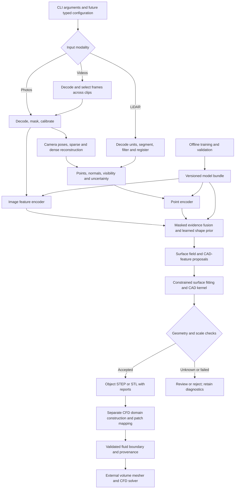

# Development architecture reference

Audience: Scan2Flow developers. Start with [DOCUMENTATION.md](../DOCUMENTATION.md) for current priorities. This reference preserves the longer-term technical design; it is not an implementation checklist for the first prototype. The current public interface is documented separately in the [CLI reference](../docs/CLI_REFERENCE.md).

## System architecture

### Data flow



All processing nodes after CLI parsing are planned. Multi-view methods provide geometric evidence when camera motion and overlap are sufficient. A single photo cannot use multi-view triangulation; it follows an explicitly marked learned-prior path. Missing image or point modalities are masked during training and inference, rather than fabricated.

COLMAP's documented workflow recovers camera poses and sparse structure before dense reconstruction; it is a candidate geometric frontend, not a CAD generator. [COLMAP tutorial](https://colmap.github.io/tutorial).

### Stage boundaries and artifacts

| Stage / source package | Responsibility | Planned output and failure conditions |
|---|---|---|
| `cli` | Parse commands and select a pipeline | Current plan or explicit unimplemented error |
| `ingestion` | Decode supplied image/video/cloud files and capture metadata | Immutable input inventory with hashes; reject undecodable or unsupported assets |
| `preprocessing` | Masks, calibration, frame selection, denoising, metric transforms | Observations, masks, normals and transforms; report missing coverage and unresolved scale |
| `reconstruction` | Camera estimation, point registration, surface inference orchestration | Geometric evidence with uncertainty; reject disconnected registrations |
| `models` | Image/point encoders, fusion, surface and feature prediction | Typed geometric proposals, observed/inferred labels, calibrated confidence |
| `cad` | Primitive/NURBS fitting, trimming, sewing, topology checks and export | Valid B-rep or explicit fitting failure; mesh-only evidence must stay identified |
| `cfd` | Construct external/internal fluid regions, cap declared openings and map patches | Fluid-boundary geometry and validation report; reject ambiguous regions |
| `data`, `development/training` | Validate manifests, split data, generate batches and optimize models | Reproducible checkpoint bundles and training history |
| `development/evaluation` | Compute geometry, topology, coverage and downstream metrics | Per-object results, aggregate/slice metrics, baseline comparison |
| `pipeline`, `utils` | Stage coordination, artifact manifests, logging, hashing and units | Atomic job lifecycle and actionable diagnostics |

The packages above currently contain role descriptions, not working pipeline implementations. Heavy libraries should be imported inside their adapters, keeping help, planning, and diagnostics usable without CAD or GPU installations.

### Reconstruction and CAD representation

1. Preserve capture files and assemble a manifest identifying the object, sensor, calibration, and physical units.
2. Segment the object. Select sharp, diverse frames; update intrinsics after crop, resize, or undistortion. For multiple videos, preserve per-clip camera metadata and find overlap across clips.
3. Estimate poses and structure for multiple images, or register LiDAR observations in a common metric frame. Record residuals and rejected observations. A low registration residual alone cannot establish correct alignment on symmetric geometry.
4. Encode images and/or points. Fuse the available evidence with modality masks, then predict surface geometry and CAD features. Keep observed regions distinguishable from learned completion.
5. Fit planes, cylinders, cones, freeform surfaces, intersections, and boundaries under geometric constraints. Use an allowlisted intermediate representation; never execute arbitrary model-generated Python.
6. Build faces, edges, shells, and solids with a CAD kernel. Reject invalid trims or topology. Sewing nearby boundaries and healing small gaps must have measured displacement bounds and must preserve functional openings.
7. Validate dimensions, coverage, B-rep validity, manifoldness, watertightness where required, self-intersection, component counts, and orientation. Export only the representations whose checks succeed.

A surface mesh stores triangles; a B-rep stores bounded surfaces and topology. Converting every triangle into a STEP face does not recover meaningful analytic CAD. STEP exchange also does not necessarily preserve a native editable feature history. The proposed fitting path is therefore a substantive engineering stage, not a file-extension conversion.

### Architectural choices and alternatives

The architecture was developed with the installed [affaan-m/ECC](https://github.com/affaan-m/ECC) plugin. [ECC_WORKFLOW.md](ECC_WORKFLOW.md) records the skills and setup instructions used.

| Choice | Rationale | Alternative and consequence |
|---|---|---|
| Local modular Python CLI | Batch workflows suit capture processing; a small parser remains easy to install | A service would add deployment and API concerns outside the CLI requirement |
| Classical geometry plus learned priors | Use measurable pose/registration evidence while learning missing shape and feature cues | Pure end-to-end CAD token generation is a research track with weaker geometric guarantees |
| Surface and analytic-feature proposals before kernel construction | Separate perception errors from CAD validity and topology failures | Mesh-only export is simpler but cannot claim analytic CAD recovery |
| Shared preprocessing and immutable model bundles | Training and inference must agree on units, normalization and sensor conventions | Independent notebook transforms risk silent incompatibility |
| Object geometry separate from fluid geometry | Internal and external flows require different regions and boundary semantics | A single automatic solid export cannot define a valid case for every solver |
| Unknown results block automatic acceptance | Missing measurements cannot establish quality | Returning success on plausible appearance would conceal unobserved or invalid geometry |

The public CLI has only reconstruction, CFD preparation and diagnostics. Training and evaluation are developer responsibilities outside the installed package. CLI packaging is implemented. Backend choices are a proposed baseline, subject to the first measured experiment rather than claims of an already validated stack.

## Backend development environment

Start with the [scaffold installation](../README.md#installation). Only its core/dev packages are declared in `pyproject.toml`; there are no `ml`, `cad`, or `all` extras yet.

| Component | Intended use | Setup and compatibility guidance |
|---|---|---|
| PyTorch | Training and inference | Select a CPU/CUDA build using the official [installation selector](https://pytorch.org/get-started/locally/); match the host driver and selected wheel |
| COLMAP | Multi-view pose and geometric baseline | Install the CLI from [COLMAP instructions](https://colmap.github.io/install.html); GPU support depends on build and selected stages |
| FFmpeg | Decode and sample video | Use an appropriate system build from [FFmpeg downloads](https://ffmpeg.org/download.html); make `ffmpeg` available on `PATH` |
| Open3D | Point-cloud filtering, registration and surface baselines | Follow [Open3D setup](https://www.open3d.org/docs/release/getting_started.html); check supported Python/platform combinations |
| CadQuery / Open CASCADE | CAD construction, healing and STEP/STL export | Use a supported environment from [CadQuery installation](https://cadquery.readthedocs.io/en/latest/installation.html); binary dependencies can limit Python/platform combinations |
| Gmsh or a solver mesher | External surface/volume meshing | Consult the [Gmsh manual](https://gmsh.info/doc/texinfo/) or your solver's meshing documentation |
| OpenFOAM or another CFD solver | External simulation workflow | Keep solver environment, case settings and version recorded separately |

For an isolated experiment, after choosing a mutually supported Python/platform combination, the upstream pip packages can be installed explicitly:

```bash
python -m pip install open3d cadquery
```

Install PyTorch using the command produced by its official selector, then install the required system binaries. The command above is exploratory environment setup, not a tested Scan2Flow backend installation. CadQuery also documents a conda-based route when binary dependencies require it. Do not combine multiple package managers in an environment without checking resolution and recording the final result.

```bash
scan2flow doctor --json
```

`doctor` checks distribution metadata and executable discovery. It does not import native libraries, run CUDA, check codecs, execute COLMAP, or prove that the components work together. Before enabling a backend, record OS/architecture, Python and dependency versions, CUDA/driver information, the code revision, a successful import/smoke test, and a resolved environment lock. No such backend lock or performance benchmark is included in this foundation.

## Capture and input contract

### Input organization

One `reconstruct` invocation describes one rigid object. Repeat `--input` for files in a deterministic order. Photo and video inputs cannot be mixed in one invocation. Multiple LiDAR observations use the same input-unit declaration; independently posed scans need registration metadata and sufficient overlap in the planned backend.

The initial adapter targets are JPEG/PNG photos, video containers decodable by the chosen FFmpeg build such as MP4/MOV, and PLY/PCD point clouds. These are planned targets, not currently supported decoders. LAS/LAZ, E57, proprietary LiDAR formats, live sensors, directory discovery, and mixed sensor jobs require explicitly implemented adapters. No file extension is validated during dry-run planning.

| Capture | Required evidence | Common failure modes |
|---|---|---|
| Single photo | Object mask, approximate known dimension, compatible learned prior; calibration when available | Unseen back faces, ambiguous depth, uncertain scale, unsupported part family |
| Multiple photos | Overlapping views, parallax, stable rigid object, scale measurement | Textureless or repeating surfaces, motion blur, disconnected camera groups |
| Video / several clips | Same requirements as photos plus frame timestamps and per-clip metadata | Near-duplicate frames, changing focus/intrinsics, rolling shutter, clipped highlights |
| LiDAR | Coordinate units, object segmentation, sensor transforms when needed | Missing returns, grazing-angle noise, multipath, holes and registration ambiguity |

Use diffuse lighting and varied viewing angles. Keep camera focus/zoom fixed where feasible. A turntable needs object/background separation: static background and rotating object cannot both satisfy one rigid camera-motion model. Additional views should expose geometry critical to flow, particularly inlets, outlets, thin gaps, and internal passages. Exterior photographs do not establish internal duct shape.

### Units, scale and coordinate frames

The proposed processing frame is right-handed, Z-up, with geometry expressed in **metres**. Preserve the transform from capture coordinates to canonical/model coordinates, including normalization scale and translation, and its inverse.

- `reconstruct --units` selects output geometry units and the unit of `--known-length`.
- `--known-length` is required for photo/video and means the measured longest side of the object's oriented bounding box. If the reconstructed longest side is `b`, the nominal scale factor is `known_length_in_metres / b`. A wrong or poorly observed extent biases all dimensions; validate several independent dimensions.
- `--scan-units` is required for LiDAR and means the source point-coordinate unit. LiDAR does not accept `--known-length`.
- `--voxel-size` and `--tolerance` are always metres, regardless of `--units` or `--scan-units`.
- `prepare-cfd --units` declares the input geometry's coordinate unit. The planned domain configs and resulting fluid-domain geometry use metres. Reject a disagreement between STEP unit metadata, its provenance, and the supplied unit; never silently rescale twice.

For example, `--known-length 250 --units mm` anchors a 0.25 m object. `--tolerance 0.0001` always requests 0.1 mm. This is a fitting/check parameter, not a measured scan accuracy or guaranteed CAD error bound.

Camera calibration is described by [calibration.schema.json](../schemas/calibration.schema.json) and the [example calibration](../examples/README.md). The proposed camera convention is +X right, +Y down, +Z forward; `world_from_sensor` is a row-major homogeneous matrix acting on column vectors. Translations use metres. Camera pixel intrinsics must match the actual image after preprocessing. Inverse transforms, sensor IDs, timestamps and alignment need semantic validation beyond JSON shape checks.

### Dataset and artifact contracts

Training examples use versioned JSONL manifests validated against [dataset-record.schema.json](../schemas/dataset-record.schema.json). Each record identifies the object, related CAD family, capture session, split, modality, input assets, CAD target, physical unit, checksums, and provenance. The same object/family/session and its synthetic derivatives must stay in one split. A JSON Schema cannot detect leakage or prove that a checksum matches an asset; future validators must inspect the complete dataset.

The [configuration guide](../configs/README.md) and [schema guide](../schemas/README.md) define the proposed fields and examples. Config paths on the CLI are relative to the current working directory; the backend convention for paths within each config/manifest must follow those guides. No user-level configuration, environment-variable override, or implicit model download is implemented.

## Configuration and output lifecycle

The TOML templates are reviewed design examples; no schema-based config loader is included. CLI-only routing settings and paths must remain explicit; future overlapping settings need documented precedence rather than silently merging them. Training config numerical hyperparameters are starting experiment settings, not demonstrated optimal values.

The planned pipeline resolves and records configuration, hashes immutable inputs, verifies model/preprocessor compatibility, and allocates a fresh output directory. It should refuse existing nonempty destinations unless a separately designed resume contract applies. Write incomplete stages to temporary locations, validate them, and publish a completion manifest atomically. Preserve diagnostics on failure without marking failed geometry as accepted. Raw capture files must remain unchanged.

Intended reconstruction outputs are `object.step`/`object.stl` according to `--format`, `quality.json`, and `provenance.json`. Intended CFD outputs describe fluid-region geometry and `boundary_patches.json`; no solver settings are inferred from appearance. A model bundle carries versioned weights, metadata, preprocessing and evaluation evidence as described in [schemas](../schemas/README.md).

Checksums and schema-valid metadata provide traceability, not trustworthy geometry by themselves. The backend must separately prove semantic consistency and quality. The scaffold creates no model, CAD, report, cache, or output directory.
