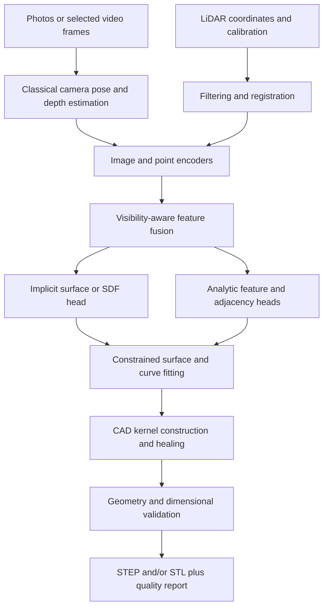

# Scan2Flow machine learning pipeline

> **Implementation status:** this is the engineering specification for a planned reconstruction backend. The repository supplies a CLI scaffold, not trained weights, a training loop, a CAD reconstruction engine, or demonstrated reconstruction accuracy. Only the end-user commands accept and validate arguments; `--dry-run` prints a plan without opening inputs or configurations. End-user execution without `--dry-run` reports an unavailable backend with exit code `3`. Training and evaluation have no executable entry point yet and are not public CLI commands.

This design applies the [affaan-m/ECC machine learning workflow](https://github.com/affaan-m/everything-claude-code/blob/main/skills/mle-workflow/SKILL.md): define the prediction and data contracts, compare reproducible baselines, evaluate important slices, package complete artifacts, and retain a tested rollback path. ECC guides development; it is not an inference dependency or a pretrained Scan2Flow model.

## 1. Prediction contract

The target is a dimensionally interpretable representation of one rigid physical object, with explicit uncertainty and enough geometric integrity to enter a separate CFD geometry preparation stage. An engineer must be able to distinguish an observed surface from an inferred completion before using its dimensions or flow passages.

| Contract element | Planned behavior |
| --- | --- |
| Input unit | One object captured in one or more photographs, one or more short videos, or a LiDAR scan; repeated inputs belong to the same rigid object. |
| Output target | Validated boundary representation (B-rep) for STEP export, triangulated surface for STL export, and a machine-readable provenance and quality report. |
| Scope | Local developer training/evaluation; a separate end-user CLI for reconstruction and CFD preparation. No hosted service, web interface, or telemetry dependency. |
| Scale | Canonical physical coordinates are metres. Preserve source-to-canonical and model-normalization transforms. |
| Confidence | Region-level observation coverage and calibrated task-specific confidence; no unsupported global “accuracy” percentage. |
| Failure policy | Reject invalid inputs, incompatible artifacts, insufficient evidence, or failed geometry checks. Keep diagnostics separate from accepted geometry. |
| Decision owner | The user selects the intended geometry use and supplies scale; the model maintainer owns promotion evidence and supported object categories. |

A single photograph does not observe the back of an object or establish an unambiguous complete shape. A learned prior can propose hidden geometry, but that geometry remains inferred. Multiple photographs also fail to reveal sealed internal cavities. These limitations must appear in the output report and evaluation results.

The scaffold's `--known-length` is an approximate longest oriented-bounding-box side for photo/video reconstruction, interpreted using `--units m|cm|mm`. That option also selects output CAD units, defaulting to metres; export must explicitly convert canonical metre coordinates. It is not a landmark annotation or a measured distance between selected pixels. This approximation needs its own scale-error evaluation. LiDAR inputs require `--scan-units`; scanner calibration, registration, and export units still require verification. `--tolerance` and `--voxel-size` always represent metres, regardless of source units.

## 2. Dataset contract

The minimal proposed manifest structure is defined in [dataset-record.schema.json](../schemas/dataset-record.schema.json), with coordinate and path rules in the [schema guide](../schemas/README.md). The broader requirements below span that manifest, referenced annotation/calibration files, and future versioned metadata extensions; they are not extra keys accepted by the current schema. No dataset loader is implemented. The eventual loader must validate both schema and semantic consistency before training begins.

| Field group | Required contents and checks |
| --- | --- |
| Identity | Stable `object_id`, `family_id`, `capture_session`, sample identifier, and immutable dataset snapshot identifier. |
| Provenance | Source URI or local relative path, content digest, acquisition date, license identifier, permitted uses, and any retention restrictions. Do not place private absolute paths in public artifacts. |
| Geometry | Ground-truth CAD path when available, topology revision, source length units, coordinate convention, part/assembly membership, and CAD validity result. |
| Observations | Image/video/cloud paths and digests, modality, frame timestamps, camera intrinsics/distortion when available, scanner calibration, and sensor quality metadata. |
| Alignment | Observation-to-CAD rigid transform, scale conversion, alignment method, residuals, and confidence. Distinguish measured alignment from estimated alignment. |
| Labels | Availability masks for surfaces, normals, occupancy/SDF, analytic features, boundary curves, adjacency, and construction sequences. Unknown labels are masked, not treated as negatives. |
| Quality | Coverage, occlusion, lighting/material class, scan density, motion blur, calibration uncertainty, and annotation provenance. |
| Split | Assigned training, validation, or test partition, with group identifiers and split-generation code/configuration digest. |

Finite coordinates and positive lengths are required. Missing optional normals or camera poses remain explicitly missing. Reject contradictory unit metadata, mismatched array lengths, invalid transforms, and references outside an authorized dataset root. Use a right-handed canonical frame, record axis semantics, and preserve the full inverse transform for export. Normal vectors transform by rotation and remain unit length.

### Sources and supervision

Start with procedurally authored, legally usable CAD solids and licensed CAD collections. Render calibrated multi-view RGB, masks, depth, normals, and partial point clouds from the same solid. Vary camera trajectories, lighting, backgrounds, reflectance, blur, resolution, scan noise, sparsity, and occlusion. Synthetic observation metadata must remain distinct from quantities available at real inference time.

Add real photographs and LiDAR paired with CAD or metrology after documenting rights to train and redistribute derived artifacts. A nominal design CAD model is not automatically the exact geometry of a manufactured, worn, or deformed specimen. Record that label mismatch and evaluate it separately from sensor error.

CAD operation sequences may support a later generative branch. [DeepCAD](https://www.cs.columbia.edu/cg/deepcad/) demonstrates learned CAD operation sequences; it does not provide an off-the-shelf guarantee of photograph-to-engineering-CAD reconstruction. Dataset access and downstream use must follow the source's actual license.

### Prevent leakage before augmentation

1. Group related CAD families, parameter variants, mirrored copies, near-duplicate meshes, and shared source designs.
2. Assign families to partitions before rendering, frame extraction, augmentation, or point sampling.
3. Keep all views, video frames, scan passes, manufactured specimens linked to a held-out design, and capture sessions for an object in that object's partition.
4. Where generalization to a new session or device is evaluated separately, define that split explicitly and still prevent accidental duplicate observations.
5. Freeze the test set. Tune hyperparameters, confidence calibration, and rejection criteria using training and validation data only.

Check both metadata identities and geometric/content similarity. Different filenames or STEP serializations are not evidence of different objects. Include split audit counts in every training run.

## 3. Shared preprocessing

Training and inference must import the same deterministic transforms, with stochastic training augmentation added in a separate stage. Cache keys include raw-content digests, preprocessing configuration, and implementation version. Cropping, resizing, and undistortion must update camera intrinsics consistently. The CLI's `--frame-step` samples decoded frames within each clip; `--max-frames` caps the retained set across all clips. Any training-only sampling variation must be declared separately and evaluated for inference compatibility.

| Modality | Planned processing | Evidence retained |
| --- | --- | --- |
| Photographs | Decode and validate; segment the object; calibrate or estimate camera parameters; match views; estimate poses; triangulate and optionally reconstruct dense depth. | Intrinsics, poses, masks, reprojection residuals, rejected views, and per-region observation count. |
| Videos | Decode with timestamps; reject unusable frames; sample for useful baseline and coverage; send frames from all videos through the image path with sequence identity retained. | Original video/frame mapping, frame-selection settings, temporal overlap, and pose estimates. |
| LiDAR | Validate coordinates and units; crop object; remove justified outliers; downsample; estimate/orient normals when needed; register overlapping scans if provided by a future adapter. | Input density, point retention, calibration, registration residuals, and sampling configuration. |

[COLMAP](https://colmap.github.io/tutorial) provides the classical pose and multi-view reconstruction reference: images need overlap and viewpoint changes; weak texture, specularities, and poor capture conditions can undermine reconstruction. Scan2Flow should keep the object frame consistent; a rotating object against a static background requires masking or an object-aware capture model.

[Open3D's registration pipelines](https://www.open3d.org/docs/release/tutorial/pipelines/index.html) provide reference implementations for global alignment, ICP refinement, and multiway registration. ICP is a refinement step whose initialization and geometry matter; a small residual alone does not disambiguate a symmetric object. Ordinary RGB video is not calibrated RGB-D input, and should not be passed to a depth-integration path as if it were.

Retain metric coordinates outside the network. If the encoder normalizes an object into a unit box, save the normalization centre and scale, transform distance labels consistently, and invert the transform before CAD fitting and reporting metric errors. Never lose absolute size through augmentation or normalization.

## 4. Proposed hybrid reconstruction model



This is a design hypothesis to validate against baselines, not a commitment to a particular network size or framework version.

- **Image encoder:** extracts features with camera and visibility context. Unposed single-image features support a prior-driven completion branch whose uncertainty remains explicit.
- **Point encoder:** consumes metric or reversibly normalized coordinates, available normals, visibility/coverage, and optional RGB/intensity with missing-channel masks.
- **Fusion:** pools corresponding evidence using poses or spatial queries. Include modality dropout during training so an absent sensor is supported deliberately; do not silently substitute zero-valued observations.
- **Surface head:** predicts a signed distance field (SDF), occupancy, or another surface representation with an explicit convention. For SDF, use negative inside and positive outside. Partial/open observations do not establish inside/outside everywhere.
- **Feature heads:** predict supported classes such as planes, cylinders, cones, spheres, sharp boundaries, and candidate adjacency, with parameters and confidence. Unsupported freeform regions require surface fitting rather than forced primitive classification.
- **CAD fitting:** fit candidate surfaces and trim curves to the inferred shape and observed points, enforcing shared-edge consistency, dimensional constraints, orientation, and a bounded deviation budget.

[BRepNet](https://arxiv.org/abs/2104.00706) motivates learning from explicit B-rep topology. It operates on existing solid-model representations; it is not itself a raw-photo reconstruction model. A B-rep graph encoder could supply supervision or candidate scoring after geometry exists.

Tessellating an implicit field creates a mesh. It does not recover exact analytic surfaces, valid B-rep topology, or the original parametric feature history. STEP export must follow successful CAD construction and validation; exporting a faceted shell must be identified as such and must not be presented as recovered design intent.

## 5. Training stages and objectives

**Stage A — measurable classical baseline.** Use registered observations, classical surface reconstruction, primitive fitting, and explicit quality checks. Include simple object-family templates only when their assumptions are declared. Establish geometry error, completion failure, validity rate, runtime, and memory before training the hybrid model.

**Stage B — supervised shape and feature learning.** Train on synthetic paired data with consistent geometry labels, then add real paired data with measured alignment uncertainty. Begin with a limited, declared feature vocabulary. Evaluate image-only, cloud-only, and combined inputs separately.

**Stage C — partial observation and completion.** Increase coverage variation and sensor corruption. Record observed-surface error separately from hidden-surface error. Evaluate whether priors improve completion without altering well-observed dimensions or closing real passages.

**Stage D — CAD fitting and downstream assessment.** Feed model predictions into constrained fitting and the CAD kernel. Kernel operations such as Boolean construction and healing are generally not an end-to-end differentiable training layer. Initially train the neural heads with geometric supervision and tune fitting on validation data. Any surrogate or differentiable approximation requires a separate design and verification.

A candidate training objective is:

```text
L = sum over available objectives j of lambda_j * masked_mean(L_j)
```

| Objective | Purpose and supervision requirements |
| --- | --- |
| Surface distance | Match sampled predicted and reference surfaces; state whether distances are squared and whether sampling is area-weighted. |
| SDF/occupancy | Regress signed distance or classify occupancy only where a trustworthy closed ground-truth solid defines it. |
| Normal consistency | Preserve orientation and local curvature where reference normals are valid. |
| Silhouette/depth reprojection | Match calibrated observations using visibility-aware rendering; exclude masked or missing depths. |
| Primitive class/parameters | Recognize analytic surfaces and fit dimensions; mask unsupported/unknown labels and handle symmetric equivalent parameterizations. |
| Boundary/adjacency | Preserve sharp edges and candidate surface connectivity using known B-rep annotations. |
| Regularization | Control unnecessary complexity; optional SDF gradient regularization is a hypothesis, not proof of watertightness. |
| CAD sequence | Optional later stage for licensed construction histories, with token and parameter supervision where available. |

Normalize each loss by its valid sample count so absent labels do not change batch weighting accidentally. Record weights, units, sampling density, reduction definitions, and missing-label counts. Avoid a topology penalty that merely rewards closing all holes: a real through-hole is useful geometry.

## 6. Reproducible execution and artifact contract

Training and model evaluation belong to developer tooling under `development/training/` and `development/evaluation/`, outside the installed user package. Neither has an executable implementation yet. The public CLI cannot start either operation.

The proposed [training settings](configs/train.toml) and [evaluation settings](configs/evaluate.toml) define internal experiments. They are not consumed by today's code. A future developer runner must validate configuration and record output location, device, seed, dataset split and complete resume state. Do not document a runnable command until that runner exists.

The broad hybrid settings describe a later research stage. The current [development plan](../DOCUMENTATION.md#next-experiment) starts with a smaller point-cloud/primitive baseline; create a dedicated experiment configuration when that experiment is implemented.

The proposed [model-bundle schema](../schemas/model-bundle.schema.json) records the immutable bundle's core provenance and artifact references. Every completed future training run must record:

- Code commit, uncommitted-change digest if applicable, schema versions, dependency lock/environment export, and hardware/runtime versions.
- Raw-data snapshot and split manifest digests; preprocessing/augmentation configuration; fully resolved training configuration and its digest.
- Random seeds and RNG states, deterministic-operation settings, device allocation, and known nondeterministic operations. A seed alone does not promise identical GPU results.
- Model weights, optimizer/scheduler state, epoch/step, mixed-precision scaler state when used, and sampling state sufficient for a documented resume contract.
- Baseline and candidate metrics, per-slice sample counts, confidence intervals, failure examples, calibration result, and promotion decision.
- Resource usage, elapsed time, peak memory, artifact digests, training-data provenance, model card, and supported/unsupported inputs.

Write artifacts into a new run directory and publish them atomically after verification. Never overwrite the only working checkpoint. Prefer a non-executable weights format where supported; load only trusted compatible artifacts and avoid unsafe deserialization. The developer runner must report the selected device and backend; it must not conceal an incompatible model or silently change validation semantics.

## 7. Evaluation and acceptance gates

Declare use-specific acceptance criteria before candidate training finishes. No reconstruction accuracy, tolerance guarantee, latency target, or automatic CFD acceptance threshold has been established for Scan2Flow.

| Evaluation layer | Required measurements |
| --- | --- |
| Observed geometry | Metric point-to-surface distances, robust percentiles and outliers, surface normal agreement, landmark and critical dimension error. |
| Completion | Hidden-surface error where full ground truth exists; coverage; uncertainty-versus-error; failure to preserve cavities/passages. |
| CAD validity | Kernel validity, closure, manifold/orientation checks, self-intersections, successful export/re-import, and solid/component counts. |
| Features | Per-class precision/recall and parameter error; preservation of bores, thin walls, fillets, leading edges, and inlet/outlet connectivity. |
| Efficiency | Reconstruction and fitting runtime distributions, peak CPU/GPU memory, export size, and success rate at documented resource limits. |
| CFD usefulness | Domain extraction success, mesh generation success, patch retention, critical passage resolution, and sensitivity of target flow quantities. |

Report distances in metres and a human-readable unit, plus any explicitly defined normalized metric. Rigid alignment may remove coordinate-frame differences; do not allow an unrestricted similarity alignment to hide scale error. Report unaligned metric errors and any aligned shape-only metric distinctly. Chamfer distance alone can miss topology defects and small flow-critical features.

Slice by modality, view count, observed coverage, object family, physical size, material/reflectivity, scan density, sensor model, synthetic versus real data, feature size, symmetry, and internal versus external geometry. Report failure and abstention rates for every slice; do not evaluate only successful exports. Bootstrap or aggregate uncertainty at the object/family level rather than counting correlated video frames as independent samples.

Calibrate confidence on held-out validation objects against a defined event, such as meeting an agreed dimensional tolerance. A decoder score or variance estimate is not automatically calibrated confidence. Use reliability curves and risk-versus-coverage analysis; retain an explicit unknown/out-of-distribution outcome when evidence is insufficient.

CFD validation is a controlled downstream experiment: hold solver, physics, domain and mesh strategy fixed, compare reconstructed geometry with trusted reference geometry, and conduct separate mesh and domain sensitivity studies. A successful mesh or converged residual is not evidence that the reconstructed object's shape is correct.

## 8. Promotion, local deployment, and rollback

Promotion requires reproducible comparisons with the baseline and previous accepted artifact, passing declared geometry/feature gates on all required slices, calibrated rejection behavior, CLI compatibility, and resource checks. Missing evaluation evidence fails promotion. A model card documents known limitations and the owner who accepted them.

Deployment means publishing an approved pretrained inference bundle with the release; an advanced user may select another compatible inference bundle with `--model`. Training checkpoints and resume state are not user inputs. First replay a representative offline corpus against candidate and previous artifacts; compare geometry, failures, resource use, and downstream effects. No online canary infrastructure is required for this CLI project.

Keep the previous checkpoint, preprocessing bundle, schema, fitting settings, and dependency environment together. Roll back by selecting that compatible bundle and rerunning affected jobs into new output directories. Preserve failed outputs and reports for diagnosis; do not replace input measurements or trusted prior results.

Track local run summaries by artifact version: input modality/coverage, rejected inputs, reconstruction and CAD failures, geometry statistics, confidence distributions, runtime, and user-verified dimensional checks. Drift is evidence to investigate, not an automatic retraining trigger. Add important failures to a versioned regression corpus after checking data permissions, then write the next experiment as a falsifiable hypothesis.

## 9. Backend implementation acceptance checklist

- [ ] Dataset validation and split audits detect family/view/session leakage and unit inconsistencies.
- [ ] Shared preprocessing preserves metric scale and inverse transforms across train/evaluation/inference.
- [ ] A reproducible classical baseline and declared evaluation slices exist.
- [ ] Partial labels, absent modalities, invalid poses, and empty observations have explicit behavior.
- [ ] Checkpoints load with version/digest checks and resume behavior is documented and tested.
- [ ] CAD fitting records geometric change; validation runs before and after export/re-import.
- [ ] Failure and uncertainty reporting distinguishes observed geometry from inferred completion.
- [ ] Promotion evidence and a tested rollback bundle accompany every released model.
