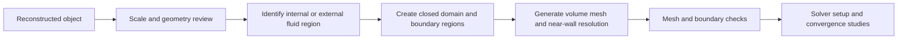

# Preparing Scan2Flow geometry for CFD

> **Implementation status:** Scan2Flow currently provides command parsing and dry-run planning. Reconstruction, CAD validation, fluid-domain extraction, meshing, and solver execution are planned backends. This guide specifies the intended workflow; no working OpenFOAM case or validated CFD result is generated by the scaffold.

“CFD-ready” is a design objective: dimensionally checked geometry with a documented route to a suitable fluid domain and mesh. A STEP or STL file alone does not establish the correctness of a simulation. Start with the [user CLI reference](CLI_REFERENCE.md) for commands and current limitations.

## 1. Separate object, fluid domain, and computational mesh

| Artifact | What it represents | What it does not establish |
| --- | --- | --- |
| Reconstructed object | Observed and inferred solid surfaces, represented as CAD and/or triangles. | The location of unseen inner walls, the intended flow region, or solver boundary conditions. |
| Fluid-domain geometry | A chosen volume occupied by fluid, with a complete boundary and semantic regions. | A volume discretization or an appropriate physical model. |
| Surface tessellation | Triangles approximating CAD surfaces at specified chordal/angular settings. | Volume cells, boundary layers, or preserved CAD feature history. |
| Computational mesh | Volume cells and boundary faces for a specific solver and simulation. | Mesh-independent results or physical validation. |

The planned pipeline is:



`reconstruct` produces the object representation. `prepare-cfd` is intended to create and validate the selected fluid domain using an explicit domain specification. Solver configuration, volume meshing, and flow solution remain separate tasks unless a future tested adapter states otherwise.

## 2. Dimensions, units, and uncertainty

Use metres internally and verify a known physical dimension after every tool boundary: reconstruction, CAD export/import, domain creation, tessellation, and mesh import. Record the source units and conversion exactly once; do not scale a model twice to compensate for contradictory metadata.

Photo/video `--known-length` is an approximate longest oriented-bounding-box side in the supplied `--units`; it cannot substitute for multiple metrology checks. For example, a body length of 150 mm may be correctly scaled while a narrow bore is still reconstructed incorrectly. LiDAR unit metadata likewise does not prove scanner calibration or correct registration.

STL has no standard reliable length-unit declaration or portable CAD-face semantics. The planned sidecar must therefore identify numerical coordinate units and region mappings. STEP provides richer geometry and unit metadata, but importers still need an explicit unit policy and a dimensional check. Gmsh's [STEP import tutorial](https://gmsh.info/doc/texinfo/#t20) documents CAD import and the OpenCASCADE unit-conversion setting.

Choose geometry tolerance from the measurement uncertainty, the smallest feature that affects the flow, and the allowable error in the quantity of interest. The CLI `--tolerance` is in metres; it is a requested geometric operation tolerance, not a promise that the photographs resolve that distance. Keep fitting tolerance, healing tolerance, tessellation deviation, point-cloud voxel size, and mesh cell size as separate recorded quantities.

Do not report measurement precision that exceeds the evidence. Compare independently measured lengths, diameters, clearances, cross-sectional areas, and critical curvature. Single-view inferred surfaces and unobserved passages require extra evidence or a different geometry source before they can support a defensible simulation.

## 3. Geometry acceptance and repair policy

The planned validator should produce the following evidence before accepting an object or domain:

- Geometry is finite, has plausible metric extents, and contains the expected number of solids and connected regions.
- Solid boundaries are closed, manifold, and consistently oriented, without unintended gaps, duplicate faces, degenerate elements, or self-intersections.
- B-rep edges, trimming curves, and face adjacency are consistent; every intended fluid region has a well-defined inside and outside.
- Intentional thin sheets or baffles are declared explicitly and treated according to solver requirements, rather than “repaired” into arbitrary solids.
- Critical openings, passage connectivity, wall thickness, sharp edges, and measured dimensions survive fitting, healing, and export.
- Re-imported STEP/STL matches the accepted pre-export geometry within the declared conversion budget.

Open CASCADE's [shape-healing tools](https://occt3d.com/dev/doc/overview/html/occt_user_guides__shape_healing.html) can diagnose and modify geometry and topology, including gaps and orientation problems. Such modifications can change the shape; keep the original and record every operation, its tolerance, affected entities, and resulting deviation. [BRepCheck_Analyzer](https://www.occt3d.com/dev/doc/refman/html/class_b_rep_check___analyzer.html) provides kernel validity checks, which should be complemented with application-specific checks for dimensions, passages, and expected region counts.

Repair must have a bounded policy. If closure requires moving surfaces beyond the accepted uncertainty or deleting an important passage, stop and report the defect. A visually smooth mesh or successful CAD-kernel return code is insufficient acceptance evidence.

The planned reconstruction report will distinguish accepted geometry, geometry requiring review, and rejected geometry. Missing measurements must remain identified as unavailable. Acceptance requires geometry evidence and review; fluid-domain acceptance is a separate downstream decision. No such report is generated by the current scaffold.

## 4. External flow

For flow around an object, the fluid occupies the enclosure outside the object. Conceptually:

```text
fluid_volume = enclosure_volume minus object_solid
```

1. Establish the object orientation, flow direction, reference area/length, and any ground plane or symmetry assumption.
2. Choose an enclosure based on the intended physics, wake development, confinement/blockage, and boundary-condition sensitivity.
3. Subtract the object, retaining exactly the intended connected fluid region and any explicitly modeled channels.
4. Identify object walls, inlet, outlet, far-field or lateral boundaries, and symmetry planes by their physical roles.
5. Check wake and separation regions, thin clearances, and the influence of enclosure size before solving the final problem.

There is no universal upstream/downstream distance or enclosure multiplier for all objects and flow regimes. Document the chosen domain and vary its extent in a sensitivity study. A closed cavity should remain excluded unless it communicates with the simulated fluid or is intentionally modeled as a separate region.

For a CAD-native meshing route, Gmsh supports OpenCASCADE Boolean operations and physical groups; its [Boolean geometry tutorial](https://gmsh.info/doc/texinfo/#t16) is a reference for domain construction. The Scan2Flow adapter must still identify the resulting entities and verify the intended fluid component.

## 5. Internal flow

For flow through a pipe, duct, valve, or housing, the relevant geometry is the void bounded by the inner wetted surfaces. An external scan of an opaque object does not reveal that void. Use directly observed internal surfaces, engineering drawings, known CAD, or another suitable measurement source when the interior is inaccessible.

1. Identify the inner walls and all intended openings; separate them from the outside of the housing.
2. Add planar or otherwise specified cap surfaces at inlet/outlet cross-sections so the fluid volume is geometrically closed.
3. Label those caps as inlet/outlet boundary regions. They close the geometry for meshing but represent open-flow boundary conditions during the simulation.
4. Extract the desired internal fluid region; verify connectivity and the absence of unintended shortcuts, leaks, or trapped volumes.
5. Inspect cross-sectional areas, hydraulic restrictions, bends, branches, clearances, and the expected inlet/outlet count.

Do not fill every hole automatically. A mounting recess may be removable after assessment; an orifice, bleed hole, narrow cooling channel, or gap can control the result. If a cap intersects walls incorrectly or the region remains ambiguous, the preparation stage must report that ambiguity rather than choose a volume silently.

## 6. Boundary names and topology changes

Boundary labels encode geometry roles, not complete physical boundary conditions. A label `inlet` does not determine velocity, pressure, turbulence, temperature, or species data. The user must select those values and models for the intended simulation.

The planned sidecar contract should contain:

| Field group | Required information |
| --- | --- |
| Provenance | Input and output hashes, model/configuration versions, CAD-kernel version, and preparation operation history. |
| Coordinates | Numerical units, coordinate frame, transforms, origin, and verified extents. |
| Domain | Internal/external mode, region identifiers, construction parameters, caps, and intended connected components. |
| Boundaries | Stable semantic identifiers and names, role, source entities, output entities/triangle regions, and mapping status. |
| Quality | Validity results, measured dimensions, unresolved issues, and changes introduced by repair or defeaturing. |

These are planned fields; the current CLI does not produce a boundary sidecar.

CAD face numbers and mesh tags can change after Boolean operations, healing, or re-import. Use operation history plus geometric signatures and adjacency to re-identify boundaries; simple numerical face IDs are insufficient. Fail on missing, multiply matched, or ambiguous semantic regions. Verify the mapping after every topology-changing operation and again after mesh generation.

STL does not reliably preserve this information across tools. Export explicit named surface regions or separate region surfaces where required, retain the sidecar, and check the mesher's resulting patch names. Gmsh's [physical-group documentation](https://gmsh.info/doc/texinfo/#Elementary-entities-vs-physical-groups) explains how entity grouping affects mesh output; include the intended fluid volume as well as its boundaries in the export strategy.

## 7. Defeaturing and tessellation

Remove a feature only after assessing its likely influence on the target quantity: drag, pressure drop, heat transfer, mixing, or another stated result. Preserve leading/trailing edges, sharp separation edges, leakage paths, narrow passages, junctions, wetted curvature, and intentional roughness where the chosen model needs them.

Maintain a change list with removed features, affected surfaces, maximum displacement, area/volume changes, and the reason each change is acceptable. Evaluate representative cases with and without the simplification; making meshing easier is not sufficient evidence that the flow remains equivalent.

Choose STL chordal and angular tolerances to retain relevant curvature and features at the target mesh resolution. Compare the tessellation to the accepted CAD, inspect slivers and tiny triangles, and keep feature edges available to the mesher. A finer tessellation does not recover detail missing from the scan and may simply increase cost.

## 8. CLI preparation contract

The complete option table is in [CLI_REFERENCE.md](CLI_REFERENCE.md). These examples are syntax-valid planning commands:

```bash
scan2flow prepare-cfd --input artifacts/reconstruction/example/object.step --output artifacts/cfd/external --flow external --units m --domain configs/cfd-external.toml --tolerance 0.0001 --dry-run
scan2flow prepare-cfd --input artifacts/reconstruction/duct/object.step --output artifacts/cfd/internal --flow internal --units m --domain configs/cfd-internal.toml --tolerance 0.0001 --dry-run
```

The illustrative tolerance is 0.1 mm; select an appropriate value for the object and evidence. `--units` declares the input geometry's numerical units and is required even when the file type can carry metadata; the future importer must detect inconsistent declarations. The domain TOML is intended to specify explicit enclosure or cap geometry and boundary roles. Current dry runs do not open these paths, parse domain contents, inspect geometry, or create output files. Removing `--dry-run` does not create a CFD domain in the scaffold.

## 9. OpenFOAM integration example

This is a manual workflow outline for an independently prepared, version-compatible OpenFOAM case. It is not an executable case supplied by Scan2Flow. Install a supported OpenFOAM distribution, activate its environment, and adapt a relevant official tutorial before using these commands. Utility names and dictionary syntax differ between distributions/releases; inspect each utility's `-help` and the documentation matching your installation.

Before meshing, prepare the geometry files in `constant/triSurface`, a background-mesh definition, surface/feature and refinement settings, mesh-quality controls, and all required case dictionaries. Verify boundary names and ensure the region-retention point lies inside the intended fluid region and away from boundaries. OpenFOAM's [snappyHexMesh guide](https://doc.openfoam.com/2606/tools/pre-processing/mesh/generation/snappyhexmesh/) describes the background mesh, feature extraction, snapping, and layer stages.

Run from the manually configured case directory:

```bash
# geometry.stl and all dictionaries must already exist and match this case.
surfaceCheck constant/triSurface/geometry.stl
blockMesh
# Run the feature-extraction utility configured for your distribution here.
snappyHexMesh -overwrite
checkMesh
```

The `-overwrite` option replaces that case's mesh; keep a copy if the previous mesh is needed. Inspect each result before proceeding. `surfaceCheck` checks surface geometry/topology and `checkMesh` checks the generated mesh; neither confirms dimensional accuracy or supplies missing physical settings. See the official [surface utility reference](https://doc.cfd.direct/openfoam/user-guide-v12/standard-utilities) and [checkMesh implementation documentation](https://api.openfoam.com/2306/checkMesh_8C.html).

Define initial fields, material properties, turbulence/transition treatment, discretization, solver controls, and boundary conditions for the actual case before running a solver. This guide deliberately does not prescribe a universal solver command: incompressible, compressible, transient, heat-transfer, and multi-region cases require different setups.

## 10. Mesh quality and near-wall treatment

Inspect positive cell volumes, skewness, non-orthogonality, face/cell connectivity, abrupt grading, feature resolution, region count, patch assignment, and near-wall layer coverage. Use the limits appropriate to the solver, discretization, and physics. OpenFOAM's [mesh-quality settings](https://doc.openfoam.com/2212/tools/pre-processing/mesh/generation/snappyhexmesh/meshquality/) expose several such controls; its example values are not universal Scan2Flow acceptance thresholds.

Plan first-cell height and layer growth from the selected wall treatment and expected local flow. A target `y+` depends on the turbulence model, wall functions or wall-resolved strategy, Reynolds number, roughness, and heat-transfer requirements. Estimate spacing, inspect the achieved `y+` distribution after solving, and revise the mesh as needed. Check that layers actually survive around tight gaps and high curvature; requesting layers does not prove their presence.

Use region and feature refinement around jets, wakes, shear layers, small passages, and other relevant gradients. A globally dense mesh can still underresolve the feature controlling pressure loss or separation.

## 11. Verification, sensitivity, and validation

For every engineering case, report the quantity of interest and the evidence supporting it:

1. **Geometry sensitivity:** vary reconstruction/scale uncertainty and relevant simplifications; compare with measured dimensions and trusted geometry.
2. **Mesh sensitivity:** use a systematic mesh sequence and compare integrated and local quantities, including near-wall resolution. Estimate observed convergence or discretization uncertainty where the assumptions hold.
3. **Domain sensitivity:** enlarge external boundaries or adjust internal inlet/outlet extensions as appropriate; check the influence on the result.
4. **Iterative/time sensitivity:** examine residuals, conservation, stability of forces or pressure loss, and time-step/time-averaging effects for unsteady cases.
5. **Physical validation:** compare with relevant experiments or trusted benchmarks using compatible boundary conditions and uncertainty estimates.

NASA's [spatial-convergence tutorial](https://www.grc.nasa.gov/www/wind/valid/tutorial/spatconv.html) provides a reference for systematic grid studies and their assumptions. Its [Turbulence Modeling Resource](https://www.nasa.gov/nasa-turbulence-modeling-resource/) points to model definitions and verification/validation cases. Residual reduction and a passing mesh check are necessary evidence in many workflows, but they do not establish physical validity by themselves.

Archive the source measurements, accepted geometry, transform/unit records, checkpoint/configuration hashes, domain definition, boundary mapping, mesher/solver versions, dictionaries, meshes, logs, convergence evidence, and reported results. That bundle allows another engineer to distinguish reconstruction error, meshing error, numerical error, and modeling assumptions.
